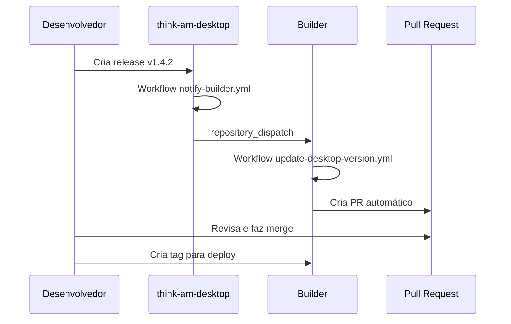

# 🤖 Automação: Atualização Automática do Builder

Este documento explica como configurar a automação que atualiza a versão do desktop client no Builder automaticamente.

## Como Funciona



## ⚙️ Configuração (Uma Vez)

### 1. Criar Personal Access Token

1. **Acesse**: https://github.com/settings/tokens/new
2. **Nome**: `builder-desktop-sync`
3. **Expiration**: No expiration (ou 1 year)
4. **Scopes necessários**:
   - ✅ `repo` (Full control of private repositories)
   - ✅ `workflow` (Update GitHub Action workflows)
5. **Generate token** → **Copie o token** (começa com `ghp_...`)

### 2. Adicionar Token como Secret no Desktop

1. **Acesse**: https://github.com/ThinkAM/think-am-desktop/settings/secrets/actions
2. **New repository secret**
3. **Name**: `BUILDER_DISPATCH_TOKEN`
4. **Secret**: Cole o token `ghp_...` que você copiou
5. **Add secret**

---

## 🚀 Uso

### Fluxo Automático

Quando você publica uma release no desktop:

```powershell
cd D:\dev\github\ThinkAM\think-am-desktop
.\scripts\create-release.ps1 -Version "1.5.0" -Message "Nova feature"
```

**O que acontece automaticamente:**

1. ✅ Tag v1.5.0 é criada e pushed
2. ✅ Workflow de release do desktop roda
3. ✅ Release é publicada no GitHub
4. ✅ Workflow `notify-builder.yml` dispara
5. ✅ Builder recebe notificação via `repository_dispatch`
6. ✅ Workflow `update-desktop-version.yml` roda no Builder
7. ✅ **Pull Request automático** é criado no Builder com:
   - Atualização de `environment.ts`
   - Atualização de `environment.prod.ts`
   - Título: "🤖 Update desktop client version to 1.5.0"
   - Label: `automated`, `dependencies`

### Você Revisa e Faz Deploy

8. ✅ **Você revisa o PR** em: https://github.com/ThinkAM/Builder/pulls
9. ✅ **Merge o PR** se estiver tudo certo
10. ✅ **Cria tag para deploy**:
    ```powershell
    cd D:\dev\github\ThinkAM\Builder
    .\scripts\create-release.ps1 -Version "0.0.11" -Message "Update desktop to 1.5.0"
    ```

---

## 🎯 Benefícios

- ✅ **Sem trabalho manual**: não precisa editar arquivos toda vez
- ✅ **Sem erros**: a versão é extraída automaticamente da tag
- ✅ **Rastreável**: cada atualização vira um commit/PR com histórico
- ✅ **Revisável**: você ainda controla quando fazer deploy (merge do PR)
- ✅ **Links funcionam automaticamente**: `/releases/latest/` sempre aponta para a versão mais recente

---

## 🔍 Troubleshooting

### PR não foi criado

**Verifique:**
1. Token `BUILDER_DISPATCH_TOKEN` está configurado?
2. Token tem permissões `repo` e `workflow`?
3. Workflow rodou sem erros? → https://github.com/ThinkAM/think-am-desktop/actions

### Erro: "Resource not accessible by integration"

**Solução:** O token precisa ter permissão `workflow`. Crie um novo token com as permissões corretas.

### Múltiplos PRs abertos

**Normal:** Se você publicar várias releases seguidas, haverá um PR para cada versão. Faça merge dos que quiser.

---

## 📝 Arquivos Envolvidos

### think-am-desktop
- `.github/workflows/notify-builder.yml` - Dispara notificação ao Builder
- `.github/workflows/release.yml` - Publica release (já existia)
- `scripts/create-release.ps1` - Helper para criar releases

### Builder
- `.github/workflows/update-desktop-version.yml` - Recebe notificação e cria PR
- `.github/workflows/deploy.yml` - Deploy para produção (já existia)
- `src/environments/environment.ts` - Config de dev (atualizado automaticamente)
- `src/environments/environment.prod.ts` - Config de produção (atualizado automaticamente)

---

**Pronto!** Agora toda release do desktop vai criar um PR automático no Builder 🎉
